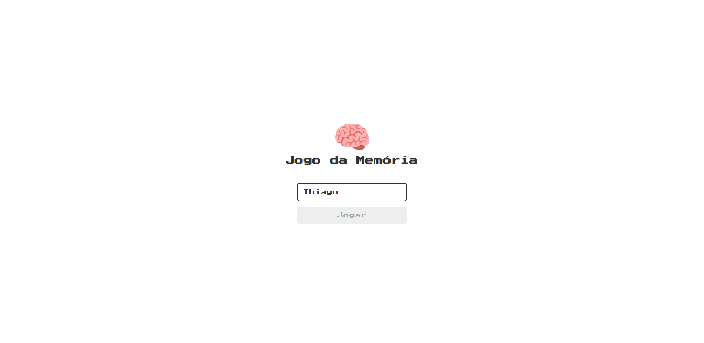
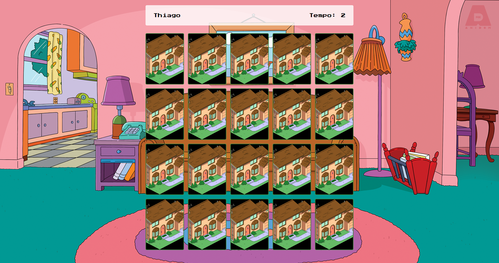

<h1 align="center"> Jogo da Memória </h1>

Jogo da memória criado utilizando HTML, CSS e JavaScript, com base nos ensinamentos dos vídeos [Jogo da memoria com JavaScript | Parte 1: Login | Criando jogo com JavaScript, HTML e CSS](https://youtu.be/NV88N1r2Qkg), [Jogo da memoria com JavaScript - Parte 2: Game | Criando jogo com JavaScript, HTML e CSS](https://youtu.be/tcbMmm77WOU), [Jogo da memoria com JavaScript - Parte 3: Final | Criando jogo com JavaScript, HTML e CSS](https://youtu.be/QbqKRxUyigw) do canal [@ManualdoDev](https://www.youtube.com/@ManualdoDev) no Youtube. 

  <a href="#-tecnologias">Tecnologias</a>&nbsp;&nbsp;&nbsp;|&nbsp;&nbsp;&nbsp;
  <a href="#-projeto">Projeto</a>&nbsp;&nbsp;&nbsp;|&nbsp;&nbsp;&nbsp;
  <a href="#-layout">Layout</a>&nbsp;&nbsp;&nbsp;|&nbsp;&nbsp;&nbsp;
  <a href="#memo-licença">Licença</a>

 

  

  

## 🚀 Tecnologias

Esse projeto foi desenvolvido com as seguintes tecnologias:

- HTML 
- CSS
- JavaScript

## 💻 Projeto

O jogo da memória é um clássico jogo formado por cartões que apresentam uma imagem em um dos lados. Cada imagem se repete em dois cartões diferentes. Em cada jogada, o participante deve virar dois cartões, caso estes sejam iguais, o par permanece virado com a face da imagem voltada para cima, e o jogador começa uma nova jogada. Se as cartas forem diferentes, elas são viradas novamente, com a face voltada para baixo, e uma nova jogada começa. O jogo termina quando todos os pares dos cartões forem encontrados. Neste projeto, a temática utilizada foi a do desenho animado, Os Simpsons.

## 🔖 Layout

Você pode navegar pelo projeto através [DESSE LINK](https://thiagomonts.github.io/memory-game/).

## :memo: Licença

Esse projeto está sob a licença MIT.

---

Desenvolvido por [Thiago Honorato](https://www.linkedin.com/in/honoratothiago/)
